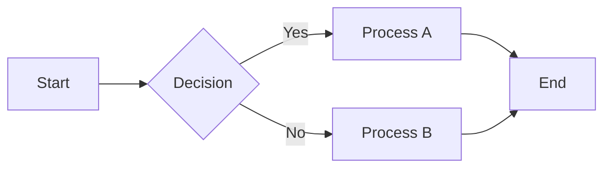
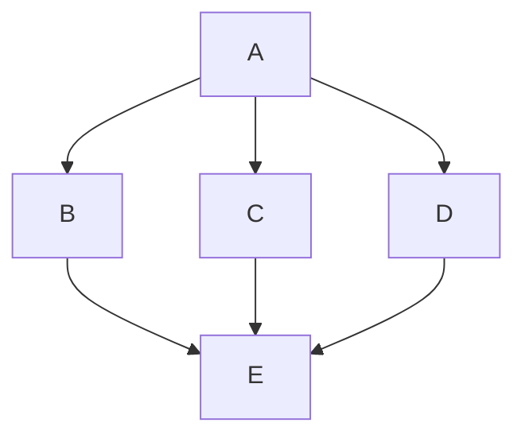

# Flowchart Example

The `flowchart` directive is not supported by WikiJS's bundled Mermaid 8.8.2.
With this patch, it works:

## Bidirectional Arrows

Not available in Mermaid 8.8.2:

## Ampersand Chaining

Multiple connections in a single statement — not supported in v8:

