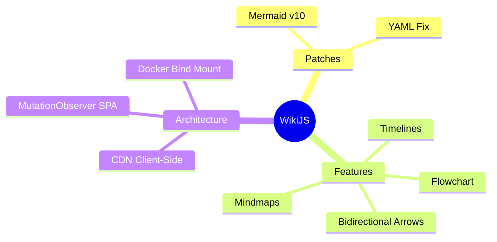

# Mindmap Example

Mindmaps are a diagram type introduced in Mermaid v9.3.
Not available at all in WikiJS's bundled Mermaid 8.8.2:

```mermaid
mindmap
  root((WikiJS))
    Patches
      Mermaid v10
      YAML Fix
    Features
      Flowchart
      Bidirectional Arrows
      Mindmaps
      Timelines
    Architecture
      CDN Client-Side
      MutationObserver SPA
      Docker Bind Mount
```
